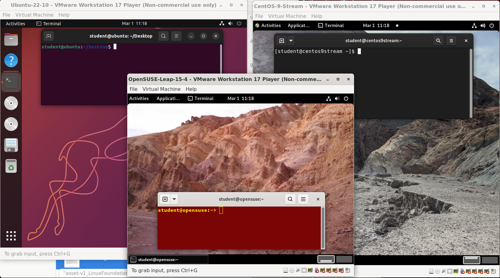

# Course Software Requirements

To fully benefit from this course, you will need to have at least one Linux distribution installed (if you are not already familiar with the term distribution, as it relates to Linux, you soon will be!).

Next, we will explore the major Linux distribution families and learn about their key characteristics. Since there are hundreds of Linux distributions, this course does not attempt to cover them all. Instead, we will focus on three primary distribution families and use selected examples from each for demonstrations, exercises, and illustrations. These distributions were chosen because they are widely used and representative of their respective families; this should not be interpreted as an endorsement.

The families and representative distributions we are using are:

- **Red Hat** Family Systems (including CentOS and Fedora)
- **SUSE** Family Systems (including openSUSE)
- **Debian** Family Systems (including Ubuntu and Linux Mint).

