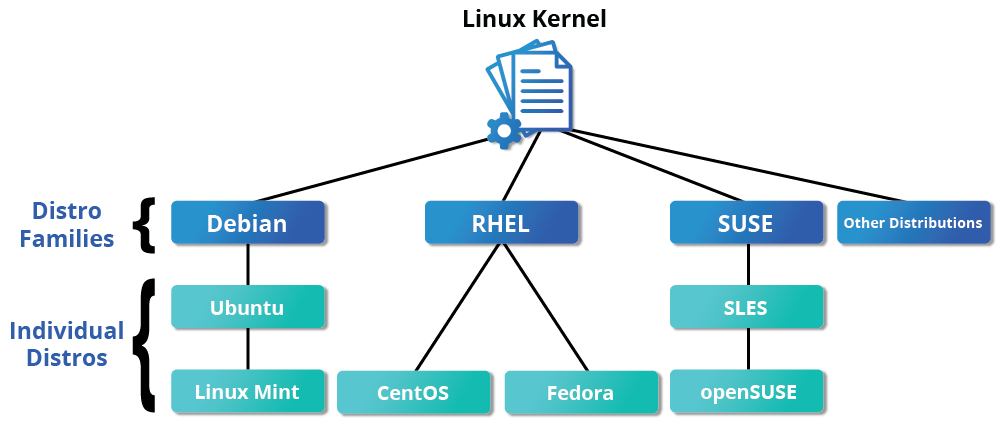
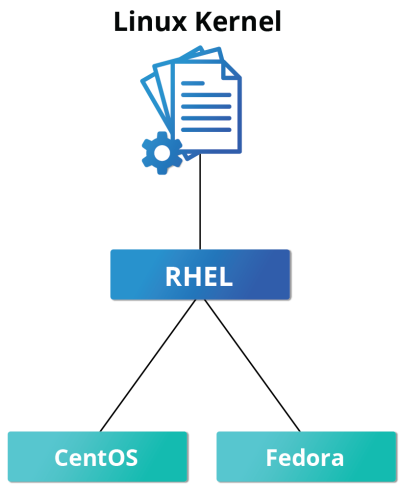
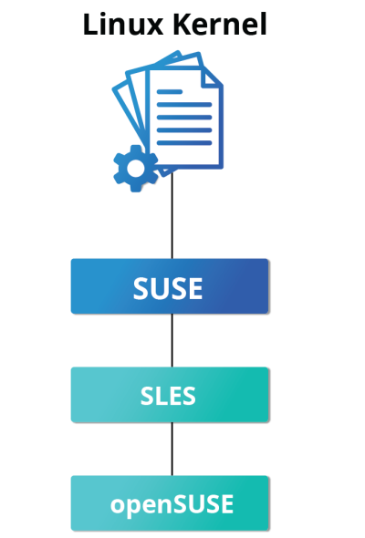
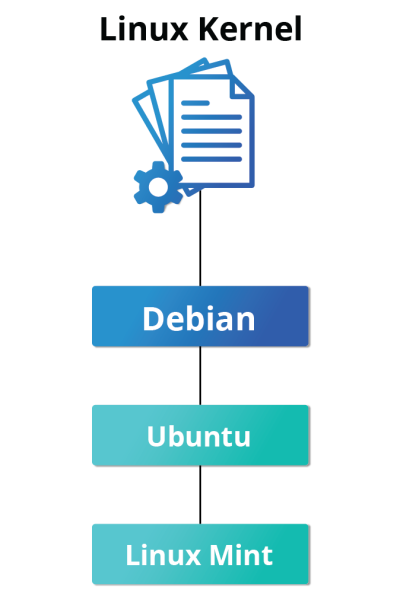

# Focus on Three Major Linux Distribution Families

In the next chapter, you will explore the key components that make up a Linux distribution. For now, it is important to understand that this course focuses on the three major Linux distribution families in use today. These families are not static—Linux continues to evolve as developers and contributors identify new needs and create solutions to address them. In some cases, this innovation leads to the creation of an entirely new distribution. In others, it results in extensions or variations built on top of existing distributions, further expanding the families that already exist.

For a rather long list of available distributions, see [Major Distributions from DistroWatch](https://distrowatch.com/dwres.php?resource=major).

## The Red Hat Family

Red Hat Enterprise Linux (RHEL) heads the family that includes CentOS, CentOS Stream, Fedora and Oracle Linux.

Fedora has a close relationship with RHEL and contains significantly more software than Red Hat's enterprise version. One reason for this is that a diverse community is involved in building Fedora, with many contributors who do not work for Red Hat. Furthermore, it is used as a testing platform for future RHEL releases.

We will use CentOS Stream and CentOS more often for activities, demonstrations, and labs because there is no cost to the end user, and there is a longer release cycle than for Fedora (which releases a new version every six months or so).

The basic version of CentOS is also virtually identical to RHEL, the most popular Linux distribution in enterprise environments. However, CentOS 8 has no scheduled updates after 2021. The replacement is CentOS 8 Stream. The key difference between the two versions is that CentOS Stream receives updates before RHEL, whereas CentOS receives them after. For most purposes, this matters very little, and not for this course. While there are alternatives to CentOS Stream that resemble the older CentOS, for this course, CentOS 8 Stream works just fine.

### Key Facts About the Red Hat Family

Some of the key facts about the Red Hat distribution family are:

- **Fedora** serves as an upstream testing platform for RHEL.
- **CentOS** is a close clone of RHEL; in fact, CentOS has been part of Red Hat since 2014.
- It supports multiple hardware platforms.
- It uses **dnf**, the RPM-based package manager (covered in detail later) to install, update, and remove packages in the system.
- **RHEL** is widely used by enterprises that host their own systems.

## The SUSE Family

The relationship between SUSE (SUSE Linux Enterprise Server, or SLES) and openSUSE is similar to the one described between RHEL, CentOS, and Fedora.

We use openSUSE as the reference distribution for the SUSE family, as it is available to end users at no cost. Because the two products are extremely similar, the material that covers openSUSE can typically be applied to SLES with few problems.

### Key Facts About the SUSE Family

Some of the key facts about the SUSE family are listed below:

- **SUSE** Linux Enterprise Server (SLES) is upstream for openSUSE.
- It uses the **RPM-based zypper package manager** (we cover it in detail later) to install, update, and remove packages in the system.
- It includes the **YaST** (Yet Another Setup Tool) application for system administration purposes.
- **SLES** is widely used in retail and many other sectors.

## The Debian Family

The Debian distribution is upstream for several other distributions, including Ubuntu. In turn, Ubuntu is upstream for Linux Mint and several other distributions. It is commonly used on both servers and desktop computers. Debian is a pure open source community project (not owned by any corporation) and has a strong focus on stability.

Debian provides by far the largest and most complete software repository to its users of any Linux distribution.

Ubuntu aims at providing a good compromise between long-term stability and ease of use. Since Ubuntu gets most of its packages from Debian’s stable branch, it also has access to a very large software repository. For those reasons, we will use Ubuntu LTS (Long Term Support) as the reference to Debian family distributions for this course.

### Key Facts About the Debian Family

Some key facts about the Debian family are listed below:

- The **Debian** family is upstream for **Ubuntu**, and **Ubuntu** is upstream for **Linux Mint** and others.
- It uses the **DPKG-based APT package manager** (using apt, apt-get, apt-cache, etc., which we cover in detail later) to install, update, and remove packages in the system.
- **Ubuntu** has been widely used for cloud deployments.
- While **Ubuntu** is built on top of Debian and is **GNOME-based** under the hood, it differs visually from the interface on standard Debian, as well as other distributions.

## More About the Software Environment

The material produced by The Linux Foundation is **distribution-flexible**. This means that technical explanations, labs, and procedures should work on almost all modern distributions. While choosing between available Linux systems, you will notice that the technical differences are mainly about package management systems, software versions, and file locations. Once you get a grasp of those differences, it becomes relatively painless to switch from one Linux distribution to another.

The desktop environment used for this course is GNOME. As we will note in the _Graphical Interface_ chapter, there are different environments, but we selected GNOME as it is the most widely used.
