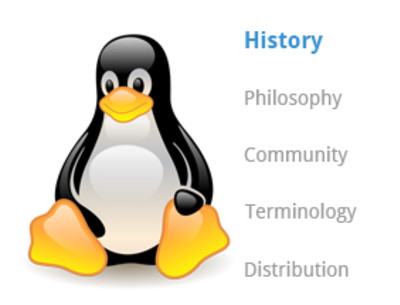
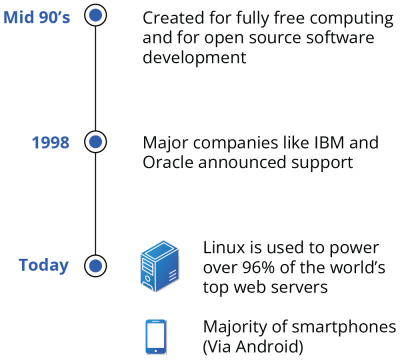
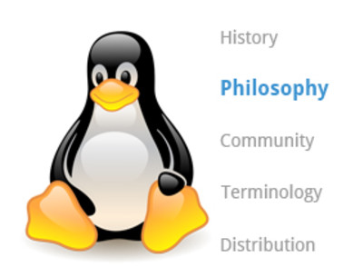
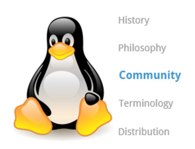
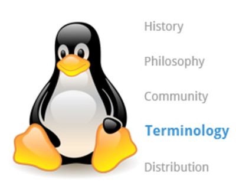
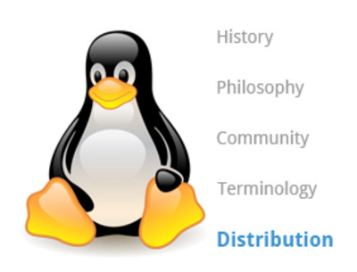
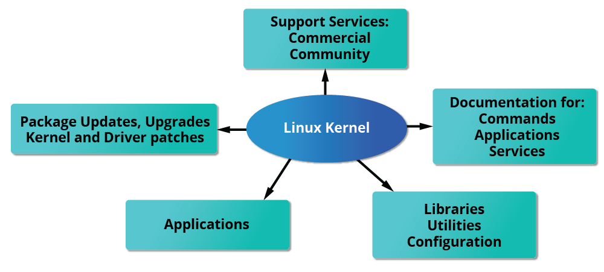
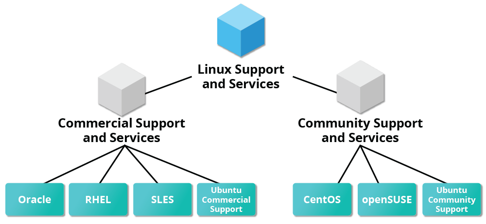

# Linux History Overview

Linux is an open source computer operating system, initially developed on and for Intel x86-based personal computers. It has been subsequently ported to an astoundingly long list of other hardware platforms, from tiny embedded appliances to the world's largest supercomputers.

In this section, we follow the surprising history of how Linux evolved from a project of one Finnish college student, into a massive effort with an enormous impact on today's world.

## More About Linux History

The Linux distributions created in the mid-90s provided the basis for fully free (in the sense of freedom, not zero cost) computing and became a driving force in the open source software movement. In 1998, major companies like IBM and Oracle announced their support for the Linux platform and began major development efforts as well.

Today, Linux powers more than half of the servers on the Internet, the majority of smartphones (via the Android system, which is built on top of Linux), more than 90 percent of the public cloud workload, and all of the world’s most powerful supercomputers.

# Linux Philosophy Overview

Every successful project or organization needs an implicit or explicit philosophy that frames its objectives and projects its growth path. This section contains a description of the philosophy adopted by the Linux community and how it has impacted Linux's amazing evolution.

Linux is constantly enhanced and maintained by a network of developers from all over the world collaborating over the Internet, with Linus Torvalds at the head. Technical skills, a desire to contribute, and the ability to collaborate with others are the only qualifications for participating.

Linux borrows heavily from the well-established family of UNIX operating systems. It was written to be a free and open source alternative; at the time, UNIX was designed for computers much more powerful than PCs, and furthermore, it was quite expensive.

Files are stored in a hierarchical filesystem, with the top node of the system being the root or simply "/". Whenever possible, Linux makes its components available via files or objects that look like files. Processes, devices, and network sockets are all represented by file-like objects and can often be worked with using the same utilities used for regular files. Linux is a fully multitasking (i.e., multiple threads of execution are performed simultaneously), multiuser operating system with built-in networking and service processes known as daemons in the UNIX world.

**NOTE**: Linux was inspired by UNIX, but it is not UNIX.

# Linux Community Overview

Suppose that, as part of your job, you need to configure a Linux file server, and you run into some difficulties. If you are not able to figure out the answer yourself or get help from a co-worker, the Linux community might just save the day!

There are many ways to engage with the Linux community, even if you are not a developer:

- **Post** queries on relevant discussion forums.
- **Subscribe** to discussion threads.
- Join local **Linux groups** that meet in your area.

The Linux community is a far-reaching ecosystem consisting of developers, system administrators, users, and vendors who use many different forums to connect with one another. Among the most popular are:

- Internet Relay Chat (IRC) software (such as WeeChat, HexChat, Pidgin, and XChat)
- Online communities and discussion boards including Linux User Groups (both local and online)
- Many collaborative projects hosted on services such as GitHub and GitLab
- Newsgroups and mailing lists, including the Linux Kernel Mailing List
- Community events, e.g., Hackathons, Install Fests, Open Source Summits, Embedded Linux Conferences, and many other conferences and get-togethers.

A portal to one of the most powerful online user communities can be found at linux.com. This site is hosted by The Linux Foundation and serves over one million unique visitors every month. It has active sections on:

- News
- Community discussion threads
- Free tutorials and user tips.

We will refer several times in this course to relevant articles or tutorials on this site.

There are also many e-learning courses on Linux and other related technologies, such as this course on edX. Many are no or low cost, and there are also more expensive training opportunities with live instructors, either in person or over the Internet. The [Linux Foundation Training](https://training.linuxfoundation.org/?_gl=1*1pyo5t3*_gcl_au*MTM5MjE4MDc1NS4xNzczNDE0MjUwLjEwNTc2ODQ0ODEuMTc3MzY0ODc0MS4xNzczNjQ4NzU5*_ga*MTQ2NzcxODIzNC4xNzczNDE0MjQ5*_ga_EMX7DDZMX4*czE3NzM2NDg3MDckbzMkZzEkdDE3NzM2NTQzNTgkajYwJGwwJGgw) website offers many such courses in all these categories but is by no means the only place you can look.

# Linux Terminology Overview

When you start exploring Linux, you will soon come across some terms which may be unfamiliar, such as distribution, boot loader, desktop environment, etc. Before we proceed further, let's stop and take a look at some basic terminology used in Linux to help you get up to speed.

Linux Terminology Examples:

- Kernel
- Distribution
- Boot Loader
- Services
- Filesystem
- X Window system
- Desktop environment
- Command line

# Linux Distributions Overview

If you are building a product designed to run on Linux, project requirements will surely include making sure the project works properly on the most widely used Linux distributions. To accomplish this, you need to learn about the different components, services, and configurations associated with each distribution. We are about to look at how you would go about doing exactly that.

So, what is a Linux distribution, and how does it relate to the Linux kernel?

The Linux kernel is the core of the operating system. A full Linux distribution consists of the kernel plus a number of other software tools for file-related operations, user management, and software package management. Each of these tools provides a part of the complete system. Each tool is often its own separate project, with its own developers working to perfect that piece of the system.

While the most recent Linux kernel (and earlier versions) can always be found in the [Linux Kernel Archives](https://www.kernel.org/), Linux distributions may be based on different kernel versions. For example, the very popular RHEL 8 distribution is based on the 4.18 kernel, which is not new, but is extremely stable, while the newer RHEL 9 distribution is based on the much later 5.14 kernel. Other distributions may move more quickly in adopting the latest kernel releases. It is important to note that the kernel is not an all-or-nothing proposition. For example, RHEL/CentOS has incorporated many of the more recent kernel improvements into their customized older versions, as have Ubuntu, openSUSE, Fedora, etc.

Examples of other essential tools and ingredients provided by distributions include the C/C++ and Clang compilers, the gdb debugger, the core system libraries applications need to link with in order to run, the low-level interface for drawing graphics on the screen, as well as the higher-level desktop environment, and the system for installing and updating the various components, including the kernel itself. And all distributions come with a rather complete suite of applications already installed.

## Distribution Roles

# Services Associated with Distributions

The vast variety of Linux distributions are designed to cater to many different audiences and organizations according to their specific needs and tastes. However, large organizations, such as companies and governmental institutions, and other entities, tend to choose the major commercially-supported distributions from Red Hat, SUSE, and Canonical (Ubuntu).

CentOS and CentOS Stream are popular free (as in no cost) alternatives to Red Hat Enterprise Linux (RHEL) and are often used by organizations that are comfortable operating without paid technical support. Note that new versions of CentOS disappeared at the end of 2021 in favor of CentOS Stream. However, at least two new RHEL-derived substitutes, Alma Linux and Rocky Linux, have established a healthy foothold.

The RHEL variants, such as CentOS and AlmaLinux, are designed to be binary-compatible with RHEL; i.e., in most cases, binary software packages will install properly across the distributions.

Ubuntu and Fedora are widely used by developers and are also popular in the educational realm. Many commercial distributors, including Red Hat, Ubuntu, SUSE, and Oracle, provide long-term fee-based support for their distributions, as well as hardware and software certification. All major distributors provide update services for keeping your system primed with the latest security and bug fixes and performance enhancements, as well as provide online support resources.

## Services Associated with Distributions

